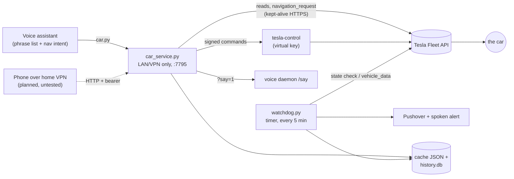

# tesla-fleet-voice

A small home service that reads and commands a Tesla through my own Tesla Fleet API app, so my voice assistant and a watchdog timer can use the car without the Tesla app.

> **Status: work in progress.** It runs for me every day (voice phrases, alerts, history), but it is a few days old and still changing. Only the North America Fleet API region has been used.

## Why I built it

I built a voice assistant for the house ("computer, lights off"). I wanted the car in the same place: "how's the car", "how hot is the car", "get the car ready", "navigate to the coffee shop", without picking up a phone and opening the Tesla app. Tesla's Fleet API lets you register your own app, so I made one and put a small service in front of it that my voice assistant and a timer call. It is built so a phone on the home VPN can call it too, but I have not tested that yet.

We charge only at Superchargers, so the other thing I wanted was a nudge when charging finishes (to move the car before idle fees), when the battery is low at night, and when the car has been left unlocked or open.

## What it does

| Ask | How it reaches the car |
|---|---|
| Battery (usable % first, then total if different), range, charging state | `vehicle_data` read. Never wakes the car: if it is asleep you get the last cached reading and its age |
| Inside / outside temperature, climate on and set point | same single `vehicle_data` read |
| Send a destination ("navigate to the museum") | REST `navigation_request`, unsigned |
| Climate on/off/set temp, media play/pause/next/prev/volume, honk, flash, sentry on/off, ping | signed with the virtual key via Tesla's `tesla-control` |
| Charge complete, low battery, left open or unlocked | watchdog timer, Pushover and/or a spoken alert |
| History: battery, miles, parked drain per day | SQLite, filled from reads the service and watchdog already make |

Lock, unlock, trunk, frunk, windows and remote start are deliberately **not** exposed. The service has no endpoint for them and a test checks that.

## How it works



- **`fleet/car_service.py`** is the one path to the car. It keeps one HTTPS connection to Fleet API open and sends commands straight away. There is no "is it awake?" pre-check; only an HTTP 408 (asleep) triggers a wake and one retry. Reads never wake the car. Each request needs both a bearer value and a source address in loopback or your LAN/VPN subnets.
- **`fleet/car.py`** is the client the voice phrases call. `--say` asks the service to speak the answer through your voice daemon.
- **Navigation** resolves a spoken place in this order: a saved place in `places.json`, then an OpenStreetMap Nominatim search near home (closest of up to 40 hits), then the raw text, which the car's own map search resolves. Spoken fillers ("on", "near me", "the closest") are stripped first because they made Nominatim return nothing.
- **`fleet/watchdog.py`** runs every 5 minutes but most runs make no API call. Asleep or offline: one state check every 15 minutes, no data read. Charging: a data read every 10 minutes, every 5 in the last 10. Parked and awake: at most one data read every 30 minutes, so polling never keeps the car awake. One `vehicle_data` call fetches charge, climate and vehicle (doors, locks) state together.
- **`fleet/history.py`** records every read into SQLite, plus the full JSON with the VIN and ids stripped, so a field nobody extracted today can be pulled out of old rows later.
- **`fleet/tesla_auth.py`** refreshes the access token 15 minutes before it expires. Tesla rotates the refresh token on every refresh, so the new pair is written atomically (temp file + rename, mode 600) before anything uses it.
- **`examples/`** has the car phrases in my voice assistant's phrase-list format and the free-form "navigate to <place>" intent, which is a few lines of code because a fixed phrase list cannot carry a captured place name.

## What I've measured

From my own logs; small numbers, a few days only.

- **Watchdog cost**, 2026-10-02 22:17 to 2026-10-05 09:00: 199 runs made an API call. 166 were state-only checks (153 found the car offline/asleep), 33 were `vehicle_data` reads. It never woke the car. Real alerts in that window: 1 charge complete, 1 left unlocked (n=2, plus 2 manual test alerts).
- **History DB**, 2026-10-02 22:12 to 2026-10-05 07:30: 50 readings and 27 online/offline state changes stored, with no extra API calls (every row comes from a read that was already happening).
- **Battery percent**: on 2026-10-02 the API returned `battery_level` 80 and `usable_battery_level` 79 while the Tesla app showed 79 (n=1). That is why the sentences say the usable number first.
- **What was proven on the real car**, 2026-10-03 (from my notes): `navigation_request` returned HTTP 200 and set the destination 4 times, unsigned. Signed commands worked: climate on and media play/pause returned 0, and a honk sent while driving was refused by the car with `ingear`, which still proves the key, session and signing are all accepted.
- **Map search fallback**: once (n=1) OpenStreetMap had no match for a small local shop; the raw text went to the car and the car's own search found and routed it. So a Nominatim miss is not treated as a failure.

### Things the Fleet API cannot do (checked 2026-10-03)

| Not possible | Why |
|---|---|
| Boombox / fart sound | REST answers 403 "Vehicle Command Protocol required", and it is not in the signed protocol either (the proxy returns not-implemented) |
| Summon / Smart Summon | not in Fleet API or vehicle-command v0.4.1 (searched the source and protos) |
| Play a named song | only play/pause, next/prev and volume; the music is the phone's app over Bluetooth |
| Honk or flash while driving | the car refuses with `ingear` |
| Multi-stop route | `navigation_waypoints_request` wants Google Place IDs, so it needs a Google Maps key (not done) |

## Install

You need:

- A Tesla you can access in the Tesla app, and a Tesla developer account (developer.tesla.com).
- A domain you control with HTTPS, where you can serve one static file and proxy one URL to a tiny Python callback. I used an existing nginx box.
- An always-on Linux machine at home with Python 3.10+ (standard library only for the service) and Go, to build Tesla's `tesla-control`.
- Optional: a voice daemon with a `POST /say` endpoint, and a Pushover account for alerts.

### 1. Fleet API setup (once)

Follow Tesla's docs for each step; these are the steps I did and the scripts that do the API parts. Everything sensitive goes in `~/.config/tesla-fleet-voice/` (mode 600), never in the repo.

1. **Create the app** on developer.tesla.com ([getting started](https://developer.tesla.com/docs/fleet-api/getting-started/what-is-fleet-api)). Allowed origin `https://example.com`, redirect URI `https://example.com/tesla/oauth/callback`, grant types client credentials and authorization code. Put the client id and secret in `fleet.env` (copy `fleet.example.env`). The app details page shows the secret in the page, so don't paste or screen-scrape that page anywhere.
2. **Make a P-256 key pair** for the virtual key ([virtual-key developer guide](https://developer.tesla.com/docs/fleet-api/virtual-keys/developer-guide)), for example:
   ```bash
   openssl ecparam -name prime256v1 -genkey -noout -out ~/.config/tesla-fleet-voice/private-key.pem
   openssl ec -in ~/.config/tesla-fleet-voice/private-key.pem -pubout -out com.tesla.3p.public-key.pem
   chmod 600 ~/.config/tesla-fleet-voice/private-key.pem
   ```
3. **Host the public key** at `https://example.com/.well-known/appspecific/com.tesla.3p.public-key.pem` (as text/plain). `server/nginx-tesla.conf` has the nginx block.
4. **Register your domain** as a partner account: `python3 fleet/setup_register.py`. It requests a partner token, POSTs `/api/1/partner_accounts` with your domain, then checks `/api/1/partner_accounts/public_key`. Lesson: a partner token requested without scopes registered fine but got 403 on that check; asking for the scopes fixed it.
5. **Authorize your account.** Run `server/oauth_callback.py` on the web server (unit in `server/oauth-callback.service`, nginx block above). The setup scripts reach its state directory over ssh (`CALLBACK_SSH_HOST`), so log in as the user the callback runs as, or that directory will refuse the write. Then `python3 fleet/setup_start_oauth.py` prints a one-time link; open it on the phone signed into the Tesla app, with the **same account**, and approve. Within 5 minutes run `python3 fleet/setup_exchange_oauth.py` to save the tokens ([third-party tokens](https://developer.tesla.com/docs/fleet-api/authentication/third-party-tokens)). Scopes used: `openid offline_access vehicle_device_data vehicle_cmds vehicle_charging_cmds` (no location).
6. **Pair the virtual key**: open `https://tesla.com/_ak/example.com` (your domain) on that phone and follow the Tesla app prompts ([virtual keys overview](https://developer.tesla.com/docs/fleet-api/virtual-keys/overview)). Tesla says the account signed into the app must match the account that authorized your app.
7. **Check**: `python3 fleet/setup_verify.py` lists your vehicles, caches the list (it holds the VIN, mode 600) and asks `fleet_status` how many are paired. Seeing the car listed does not prove pairing; the paired count does.
8. **Build `tesla-control`** from [teslamotors/vehicle-command](https://github.com/teslamotors/vehicle-command). `go install ...@latest` failed for me because the module uses replace directives, so build from a clone:
   ```bash
   git clone https://github.com/teslamotors/vehicle-command && cd vehicle-command
   git checkout v0.4.1
   go build -o ~/.local/bin/tesla-control ./cmd/tesla-control
   ```
9. **Billing**: Fleet API usage is billed per request type (wakes cost much more than data reads). Check Tesla's current pricing and your account's billing settings before you leave a timer running.

Notes from my setup: the developer account does not have to be the car owner's account. My token came from my own account (I am a driver on the car); the pairing step was done in the Tesla app by the owner, after which `fleet_status` reported the key as paired. I have not tested other combinations.

### 2. The home service

```bash
git clone <this repo> ~/tesla-fleet-voice
cp ~/tesla-fleet-voice/fleet.example.env ~/.config/tesla-fleet-voice/fleet.env
chmod 600 ~/.config/tesla-fleet-voice/fleet.env      # fill in SERVICE_TOKEN, ALLOWED_NETS, HOME_LAT/LON...
cp ~/tesla-fleet-voice/places.example.json ~/.config/tesla-fleet-voice/places.json   # your own places

cp ~/tesla-fleet-voice/systemd/car-* ~/.config/systemd/user/
systemctl --user daemon-reload
systemctl --user enable --now car-service.service car-watchdog.timer
```

The units assume the clone is at `~/tesla-fleet-voice`. A user unit does not load your shell profile, so anything it needs must be in `fleet.env` or the unit itself.

## Running it

```bash
fleet/car.py battery                 # {"state": "online", "sentence": "The car's at 79 percent ...", ...}
fleet/car.py temp --say              # and speak it
fleet/car.py nav "museum"            # saved place, map search near home, or raw text to the car
fleet/car.py cmd climate-on
fleet/car.py cmd climate-set-temp 70f
fleet/tesla_nav.py "Empire State Building, New York, NY"   # dry run: prints the request, sends nothing
fleet/watchdog.py --dry              # everything except the alert
fleet/history.py days                # per day: readings, min/max %, miles, charged %, parked drain %
journalctl --user -u car-service -n 20
```

Voice: add the phrases from `examples/tricks.car.yaml` to your phrase list and `examples/nav_intent.py` to your daemon. Test negatives too: "turn on the AC" should still go to the house, not the car.

Tests (no network, no car): `python3 -m pytest tests`.

## What is not included

- Credentials, tokens, the private key, the vehicle list (it holds the VIN) and my saved places. They live outside the repo; `fleet.example.env` and `places.example.json` show the shape.
- `tesla-control` itself. It is Tesla's code; build it from their repo (step 8).
- The voice assistant. The phrase list and nav intent here are examples for it.
- A Pushover account and app key.

## Built with Claude Code

I built this with Claude Code: it wrote most of the scripts while I chose the features, tested them on the car and decided the rules (never wake the car for a read, no lock or unlock by voice). This public copy was prepared with it too, from my private working version.

## License

MIT, see [LICENSE](LICENSE).
